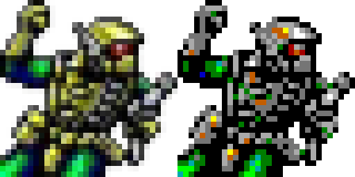
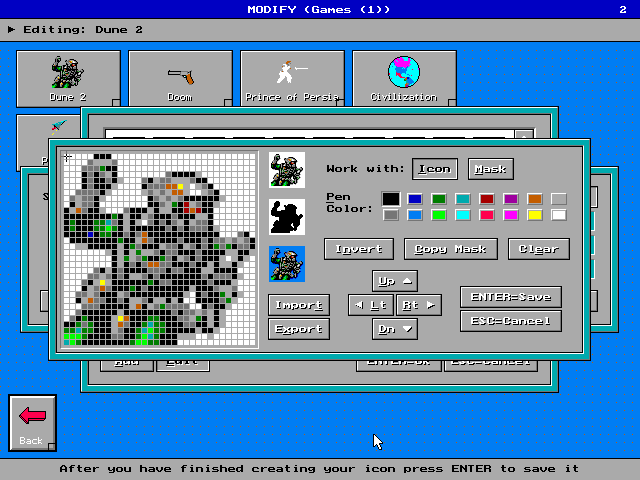

# Quick Menu Icon Creator

[Quick Menu](https://en.wikipedia.org/wiki/Quick_Menu) is a graphical user
interface for MS-DOS developed by OSCS Software Development. Quick Menu allows
users to create their own menu structures for efficient launching of games and
applications without having to navigate a drive via MS-DOS commands such as `cd`
and `dir`.

Quick Menu employs 32x32 icons with the EGA (4 bits per pixel) color scheme. The
icons are stored in Quick Menu in an internal archive, but can be exported to or
imported from `.icc` files. This repository contains a set of Python-based
scripts to read those `.icc` files or to convert `.png` files to `.icc` files.



## ICC File format

The ICC file format stores an icon. These files are always exactly 1032 bytes
long and can be separated into two parts, being the icon bitmap and the mask
bitmap. Each bitmap start with a header sequence of 4 bytes (`0x1F, 0x00, 0x1F,
0x00`) followed by the pixel data. Each 16 bytes of pixel data corresponds to a
row of the icon. The pixel information is stored on per-bit basis. The first
four bytes correspond to the LSB of each pixel for each of the 32 pixels in a
row. Each subsequent set of 4 bytes correspond to the next bit for each pixel in
that row such that exactly 16 bytes are needed to store all the pixel
information for a given row (giving a color resolution of 4 bits per pixel). The
mask bitmap uses the same encoding as the icon bitmap, yet each pixel either
corresponds to a value of `0x0` (transparent) or to `0xF` (opague).

## Conversion

The Python script in this repository allows for a conversion from a `.png` to an
`.icc`. It is assumed that these `.png` files carry an alpha channel (allowing
for transparency) and are exactly 32x32 pixels in size. Since `.png` files er
encoded with 24 bits per pixel (bpp), a downconversion to the EGA color scheme
is required. This is achieved by calculating the vector difference between the
24bpp color and each of the 4bpp colors. The color in the EGA pallette whose
difference has the least Euclidean distance with respect to the original 24bpp
color is then chosen. Although this conversion is automatic, it should be noted
that this is not always the most ideal result and the user is recommended to
make further adjustment to the final icon in Quick Menu.



## Dependencies

The scripts in this repository depend on the
[PIL](https://pillow.readthedocs.io/en/stable/) and [NumPy](https://numpy.org/)
modules. You can install these modules easily using

```bash
pip install -r requirements.txt
```

## Usage

### Conversion

1. Clone this repository.
2. Place source `.PNG` files in the `.png` folder
3. Use `png2icc.py` to convert `.png` files to `.icc` files. Note that you need
   to adjust the paths in this file.

### Visualization

1. Clone this repository.
2. Place `.ICC` in the `icc` folder.
3. Use `icc-show.py` to visualize an `.ICC` file